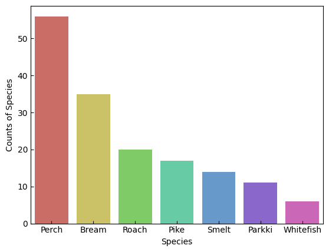
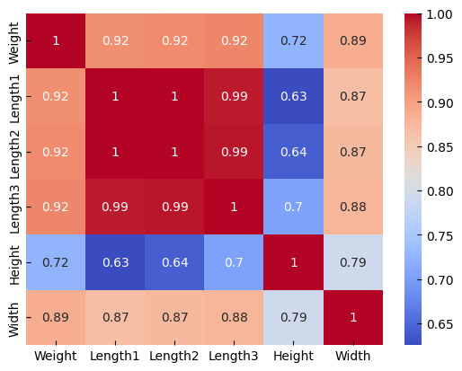
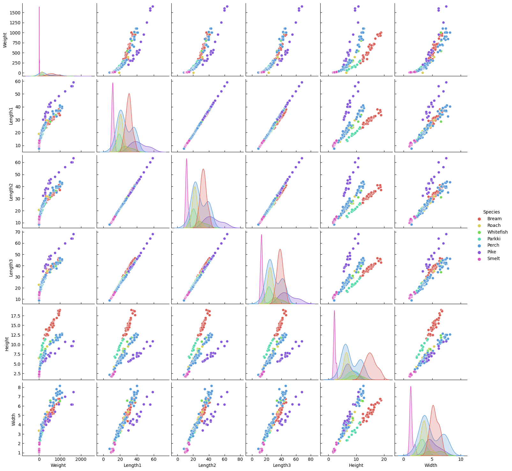
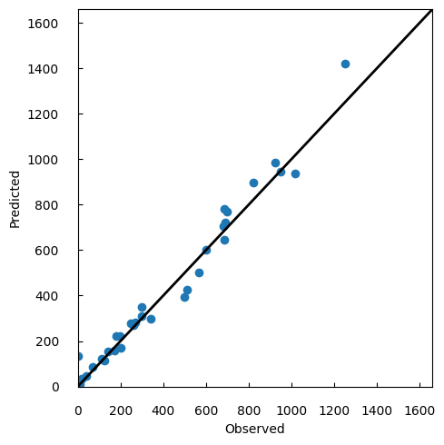
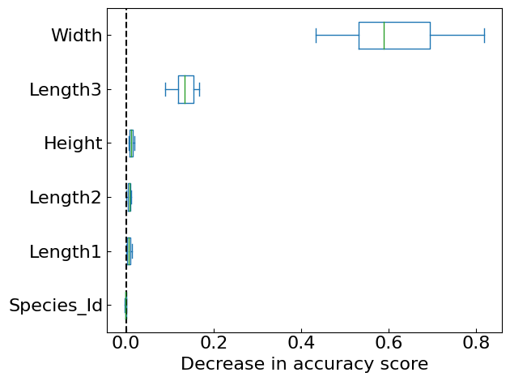
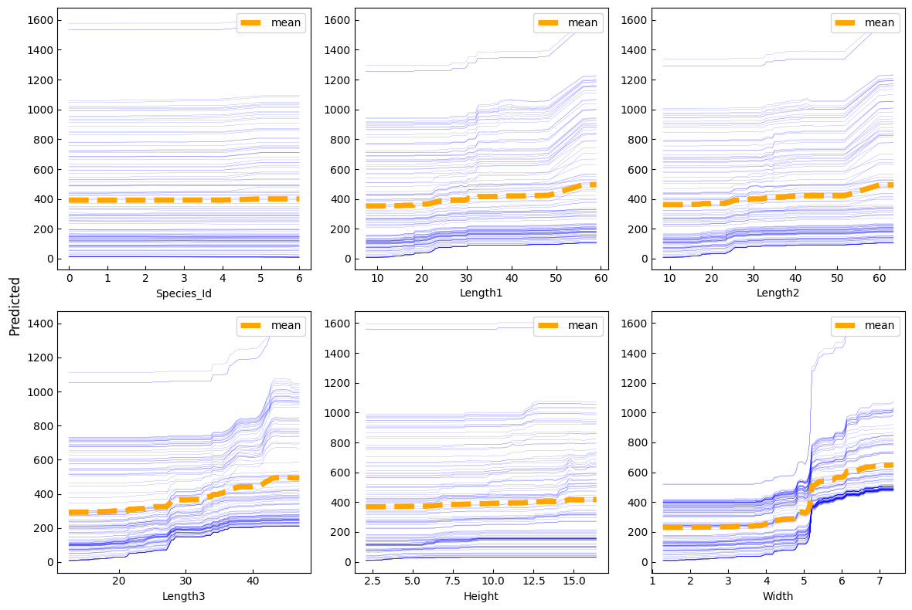
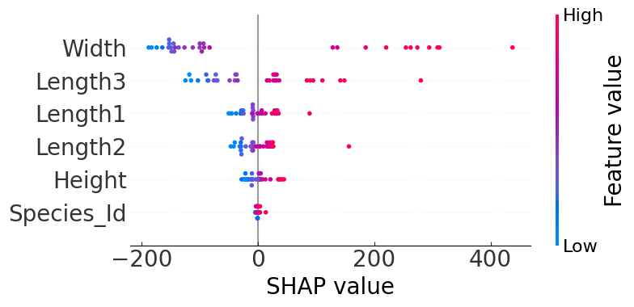

# Fish Weight Prediction and Variable Importance Visualization using Random Forests

## About Data
Copyright (c) 2020 Aung Pyae  
This program is free software; you can redistribute it and/or
modify it under the terms of the GNU General Public License
as published by the Free Software Foundation; either version 2
of the License, or any later version.  

This program is distributed in the hope that it will be useful,
but WITHOUT ANY WARRANTY; without even the implied warranty of
MERCHANTABILITY or FITNESS FOR A PARTICULAR PURPOSE. See the
GNU General Public License for more details.  

You should have received a copy of the GNU General Public License
along with this program. If not, see http://www.gnu.org/licenses/.  

[Fish market(kaggle)](https://www.kaggle.com/datasets/aungpyaeap/fish-market)

## About Code
This code aims to estimate the fish individuals' weight from their measurements using Random Forest.    
Also, In this code visualizes the importance of variables.


```python
import numpy as np
import pandas as pd
import matplotlib.pyplot as plt
import seaborn as sns
from sklearn.ensemble import RandomForestRegressor
from sklearn.model_selection import train_test_split
from sklearn.metrics import r2_score
from sklearn.metrics import mean_squared_error
from sklearn.metrics import mean_absolute_error
from sklearn.inspection import permutation_importance
from sklearn.inspection import partial_dependence
import shap
import warnings
```


```python
warnings.simplefilter('ignore')
```


```python
%matplotlib inline
plt.rcParams['xtick.direction'] = 'in'
plt.rcParams['ytick.direction'] = 'in'
plt.rcParams['xtick.minor.visible'] = False
plt.rcParams['ytick.minor.visible'] = False
```


```python
df = pd.read_csv('Data/Fish.csv')
df.insert(1, 'Species_Id', pd.factorize(df['Species'])[0])
df
```


<div>
<style scoped>
    .dataframe tbody tr th:only-of-type {
        vertical-align: middle;
    }

    .dataframe tbody tr th {
        vertical-align: top;
    }

    .dataframe thead th {
        text-align: right;
    }
</style>
<table border="1" class="dataframe">
  <thead>
    <tr style="text-align: right;">
      <th></th>
      <th>Species</th>
      <th>Species_Id</th>
      <th>Weight</th>
      <th>Length1</th>
      <th>Length2</th>
      <th>Length3</th>
      <th>Height</th>
      <th>Width</th>
    </tr>
  </thead>
  <tbody>
    <tr>
      <th>0</th>
      <td>Bream</td>
      <td>0</td>
      <td>242.0</td>
      <td>23.2</td>
      <td>25.4</td>
      <td>30.0</td>
      <td>11.5200</td>
      <td>4.0200</td>
    </tr>
    <tr>
      <th>1</th>
      <td>Bream</td>
      <td>0</td>
      <td>290.0</td>
      <td>24.0</td>
      <td>26.3</td>
      <td>31.2</td>
      <td>12.4800</td>
      <td>4.3056</td>
    </tr>
    <tr>
      <th>2</th>
      <td>Bream</td>
      <td>0</td>
      <td>340.0</td>
      <td>23.9</td>
      <td>26.5</td>
      <td>31.1</td>
      <td>12.3778</td>
      <td>4.6961</td>
    </tr>
    <tr>
      <th>3</th>
      <td>Bream</td>
      <td>0</td>
      <td>363.0</td>
      <td>26.3</td>
      <td>29.0</td>
      <td>33.5</td>
      <td>12.7300</td>
      <td>4.4555</td>
    </tr>
    <tr>
      <th>4</th>
      <td>Bream</td>
      <td>0</td>
      <td>430.0</td>
      <td>26.5</td>
      <td>29.0</td>
      <td>34.0</td>
      <td>12.4440</td>
      <td>5.1340</td>
    </tr>
    <tr>
      <th>...</th>
      <td>...</td>
      <td>...</td>
      <td>...</td>
      <td>...</td>
      <td>...</td>
      <td>...</td>
      <td>...</td>
      <td>...</td>
    </tr>
    <tr>
      <th>154</th>
      <td>Smelt</td>
      <td>6</td>
      <td>12.2</td>
      <td>11.5</td>
      <td>12.2</td>
      <td>13.4</td>
      <td>2.0904</td>
      <td>1.3936</td>
    </tr>
    <tr>
      <th>155</th>
      <td>Smelt</td>
      <td>6</td>
      <td>13.4</td>
      <td>11.7</td>
      <td>12.4</td>
      <td>13.5</td>
      <td>2.4300</td>
      <td>1.2690</td>
    </tr>
    <tr>
      <th>156</th>
      <td>Smelt</td>
      <td>6</td>
      <td>12.2</td>
      <td>12.1</td>
      <td>13.0</td>
      <td>13.8</td>
      <td>2.2770</td>
      <td>1.2558</td>
    </tr>
    <tr>
      <th>157</th>
      <td>Smelt</td>
      <td>6</td>
      <td>19.7</td>
      <td>13.2</td>
      <td>14.3</td>
      <td>15.2</td>
      <td>2.8728</td>
      <td>2.0672</td>
    </tr>
    <tr>
      <th>158</th>
      <td>Smelt</td>
      <td>6</td>
      <td>19.9</td>
      <td>13.8</td>
      <td>15.0</td>
      <td>16.2</td>
      <td>2.9322</td>
      <td>1.8792</td>
    </tr>
  </tbody>
</table>
<p>159 rows × 8 columns</p>
</div>


```python
df.info()
```

    <class 'pandas.core.frame.DataFrame'>
    RangeIndex: 159 entries, 0 to 158
    Data columns (total 8 columns):
     #   Column      Non-Null Count  Dtype  
    ---  ------      --------------  -----  
     0   Species     159 non-null    object 
     1   Species_Id  159 non-null    int64  
     2   Weight      159 non-null    float64
     3   Length1     159 non-null    float64
     4   Length2     159 non-null    float64
     5   Length3     159 non-null    float64
     6   Height      159 non-null    float64
     7   Width       159 non-null    float64
    dtypes: float64(6), int64(1), object(1)
    memory usage: 10.1+ KB


### Investigating Missing Values


```python
print('Is there any NaN value in the dataset: ', df.isnull().values.any())
```

    Is there any NaN value in the dataset:  False


### Different Species and Their Counts:


```python
sp = df['Species'].value_counts()
df_sp = pd.DataFrame(sp)
df_sp.T
```


<div>
<style scoped>
    .dataframe tbody tr th:only-of-type {
        vertical-align: middle;
    }

    .dataframe tbody tr th {
        vertical-align: top;
    }

    .dataframe thead th {
        text-align: right;
    }
</style>
<table border="1" class="dataframe">
  <thead>
    <tr style="text-align: right;">
      <th>Species</th>
      <th>Perch</th>
      <th>Bream</th>
      <th>Roach</th>
      <th>Pike</th>
      <th>Smelt</th>
      <th>Parkki</th>
      <th>Whitefish</th>
    </tr>
  </thead>
  <tbody>
    <tr>
      <th>count</th>
      <td>56</td>
      <td>35</td>
      <td>20</td>
      <td>17</td>
      <td>14</td>
      <td>11</td>
      <td>6</td>
    </tr>
  </tbody>
</table>
</div>


```python
sns.barplot(x=df_sp.index, y=df_sp['count'], palette='hls')
plt.xlabel('Species')
plt.ylabel('Counts of Species')
plt.show()
```


    

    


### Correlation of the Variables without the variable of species


```python
sns.heatmap(df.drop(['Species', 'Species_Id'],axis=1).corr(), annot=True, cmap='coolwarm')
```


    <Axes: >


    

    


```python
sns.pairplot(df.drop('Species_Id',axis=1), kind='scatter', hue='Species', palette='hls')
```


    <seaborn.axisgrid.PairGrid at 0x7fc9f3418c10>


    

    


### Preparing the Random Forest modeling


```python
X = df.drop(['Species','Weight'], axis=1)
y = df['Weight']
```


```python
X_train, X_test, y_train, y_test = train_test_split(X, y, test_size=0.2, random_state=314)
```


```python
forest = RandomForestRegressor()
```

### Predictions


```python
forest.fit(X_train, y_train)
```


<style>#sk-container-id-2 {color: black;background-color: white;}#sk-container-id-2 pre{padding: 0;}#sk-container-id-2 div.sk-toggleable {background-color: white;}#sk-container-id-2 label.sk-toggleable__label {cursor: pointer;display: block;width: 100%;margin-bottom: 0;padding: 0.3em;box-sizing: border-box;text-align: center;}#sk-container-id-2 label.sk-toggleable__label-arrow:before {content: "▸";float: left;margin-right: 0.25em;color: #696969;}#sk-container-id-2 label.sk-toggleable__label-arrow:hover:before {color: black;}#sk-container-id-2 div.sk-estimator:hover label.sk-toggleable__label-arrow:before {color: black;}#sk-container-id-2 div.sk-toggleable__content {max-height: 0;max-width: 0;overflow: hidden;text-align: left;background-color: #f0f8ff;}#sk-container-id-2 div.sk-toggleable__content pre {margin: 0.2em;color: black;border-radius: 0.25em;background-color: #f0f8ff;}#sk-container-id-2 input.sk-toggleable__control:checked~div.sk-toggleable__content {max-height: 200px;max-width: 100%;overflow: auto;}#sk-container-id-2 input.sk-toggleable__control:checked~label.sk-toggleable__label-arrow:before {content: "▾";}#sk-container-id-2 div.sk-estimator input.sk-toggleable__control:checked~label.sk-toggleable__label {background-color: #d4ebff;}#sk-container-id-2 div.sk-label input.sk-toggleable__control:checked~label.sk-toggleable__label {background-color: #d4ebff;}#sk-container-id-2 input.sk-hidden--visually {border: 0;clip: rect(1px 1px 1px 1px);clip: rect(1px, 1px, 1px, 1px);height: 1px;margin: -1px;overflow: hidden;padding: 0;position: absolute;width: 1px;}#sk-container-id-2 div.sk-estimator {font-family: monospace;background-color: #f0f8ff;border: 1px dotted black;border-radius: 0.25em;box-sizing: border-box;margin-bottom: 0.5em;}#sk-container-id-2 div.sk-estimator:hover {background-color: #d4ebff;}#sk-container-id-2 div.sk-parallel-item::after {content: "";width: 100%;border-bottom: 1px solid gray;flex-grow: 1;}#sk-container-id-2 div.sk-label:hover label.sk-toggleable__label {background-color: #d4ebff;}#sk-container-id-2 div.sk-serial::before {content: "";position: absolute;border-left: 1px solid gray;box-sizing: border-box;top: 0;bottom: 0;left: 50%;z-index: 0;}#sk-container-id-2 div.sk-serial {display: flex;flex-direction: column;align-items: center;background-color: white;padding-right: 0.2em;padding-left: 0.2em;position: relative;}#sk-container-id-2 div.sk-item {position: relative;z-index: 1;}#sk-container-id-2 div.sk-parallel {display: flex;align-items: stretch;justify-content: center;background-color: white;position: relative;}#sk-container-id-2 div.sk-item::before, #sk-container-id-2 div.sk-parallel-item::before {content: "";position: absolute;border-left: 1px solid gray;box-sizing: border-box;top: 0;bottom: 0;left: 50%;z-index: -1;}#sk-container-id-2 div.sk-parallel-item {display: flex;flex-direction: column;z-index: 1;position: relative;background-color: white;}#sk-container-id-2 div.sk-parallel-item:first-child::after {align-self: flex-end;width: 50%;}#sk-container-id-2 div.sk-parallel-item:last-child::after {align-self: flex-start;width: 50%;}#sk-container-id-2 div.sk-parallel-item:only-child::after {width: 0;}#sk-container-id-2 div.sk-dashed-wrapped {border: 1px dashed gray;margin: 0 0.4em 0.5em 0.4em;box-sizing: border-box;padding-bottom: 0.4em;background-color: white;}#sk-container-id-2 div.sk-label label {font-family: monospace;font-weight: bold;display: inline-block;line-height: 1.2em;}#sk-container-id-2 div.sk-label-container {text-align: center;}#sk-container-id-2 div.sk-container {/* jupyter's `normalize.less` sets `[hidden] { display: none; }` but bootstrap.min.css set `[hidden] { display: none !important; }` so we also need the `!important` here to be able to override the default hidden behavior on the sphinx rendered scikit-learn.org. See: https://github.com/scikit-learn/scikit-learn/issues/21755 */display: inline-block !important;position: relative;}#sk-container-id-2 div.sk-text-repr-fallback {display: none;}</style><div id="sk-container-id-2" class="sk-top-container"><div class="sk-text-repr-fallback"><pre>RandomForestRegressor()</pre><b>In a Jupyter environment, please rerun this cell to show the HTML representation or trust the notebook. <br />On GitHub, the HTML representation is unable to render, please try loading this page with nbviewer.org.</b></div><div class="sk-container" hidden><div class="sk-item"><div class="sk-estimator sk-toggleable"><input class="sk-toggleable__control sk-hidden--visually" id="sk-estimator-id-2" type="checkbox" checked><label for="sk-estimator-id-2" class="sk-toggleable__label sk-toggleable__label-arrow">RandomForestRegressor</label><div class="sk-toggleable__content"><pre>RandomForestRegressor()</pre></div></div></div></div></div>


```python
y_test_pred = forest.predict(X_test)
```

### Analysing the results of the Model from Train Dataset and Predictions


```python
print('R2 : ', r2_score(y_test, y_test_pred))
print('MAE : ',mean_absolute_error(y_test, y_test_pred))
print('RMSE : ',np.sqrt(mean_squared_error(y_test, y_test_pred)))
```

    R2 :  0.9685030605193581
    MAE :  42.92772916666667
    RMSE :  58.949743253552214


```python
disp_min = 0
disp_max = y.max() + 10
fig, ax = plt.subplots(figsize=(5, 5))
ax.scatter(y_test, y_test_pred)
ax.plot([disp_min, disp_max], [disp_min, disp_max], color='black', linewidth=2.0)
ax.set_xlim(disp_min, disp_max)
ax.set_ylim(disp_min, disp_max)
ax.set_xlabel('Observed')
ax.set_ylabel('Predicted')
ax.tick_params(pad=15)
fig.tight_layout()
fig.show()
```


    

    


### Variable Importance Visualization

#### Permutation Feature Importance


```python
result = permutation_importance(forest, X_test, y_test, n_repeats=10, random_state=314)
sorted_importances_idx = result.importances_mean.argsort()
importances = pd.DataFrame(result.importances[sorted_importances_idx].T,
                        columns=X_test.columns[sorted_importances_idx],)
ax = importances.plot.box(vert=False, whis=10,fontsize=16)
ax.axvline(x=0, color='k', linestyle='--')
ax.set_xlabel('Decrease in accuracy score',fontsize=16)
ax.figure.tight_layout()
plt.show()
plt.clf()
plt.close()
```


    

    


#### Partial Dependence (PD) and Individual Conditional Expectation (ICE)


```python
col_ind = 0
row_ind = 0
num_column = 3
num_row = int(len(X_train.columns) / num_column)

fig, ax = plt.subplots(num_row, num_column, figsize=(12, 8))
for column in X_train.columns:
    pd_and_ice = partial_dependence(forest, features=[column], percentiles=(0.05, 1-0.05), X=X_train, kind='individual')
    feature_grid = pd_and_ice['values'][0]
    pd_mean = pd_and_ice['individual'][0,:,:].mean(axis=0)
    pd_ind = np.squeeze(np.squeeze(pd_and_ice['individual']))

    for i in range(len(pd_ind)):
        ax[row_ind][col_ind].plot(feature_grid, pd_ind[i], color='blue', linewidth=0.1)
    ax[row_ind][col_ind].plot(feature_grid, pd_mean, label='mean', color='orange', linestyle = 'dashed', linewidth=5)
    ax[row_ind][col_ind].set_xlabel(column)
    ax[row_ind][col_ind].legend(loc='upper right') 
    
    col_ind += 1
    if col_ind == num_column:
        col_ind = 0
        row_ind += 1

fig.supylabel('Predicted')      
fig.tight_layout()
fig.show()
```


    

    


#### SHapley Additive exPlanations (SHAP)


```python
explainer = shap.Explainer(forest, X_test)
shap_values = explainer(X_test,check_additivity=False)
```


```python
fig, ax = plt.gcf(), plt.gca()
shap.plots.beeswarm(shap_values, max_display=10, show=False)
ax.tick_params(labelsize=20)
ax.set_xlabel('SHAP value', fontsize=20)
cb_ax = fig.axes[1]
cb_ax.tick_params(labelsize=16)
cb_ax.set_ylabel('Feature value', fontsize=20)
fig.tight_layout()
fig.show()
```


    

    


## Summary
The code predicted the weight of the fish in a random forest. It also visualized the variables' importance to clarify the model's behavior.  
I predicted that the type of fish would be the most important variable, but the results showed that the width of the fish was more important.  
If you find this code helpful, I would appreciate a star.  
Thank you for taking the time to look at this to the end.  　
